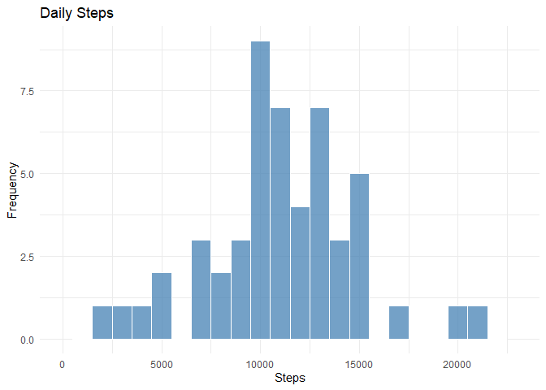
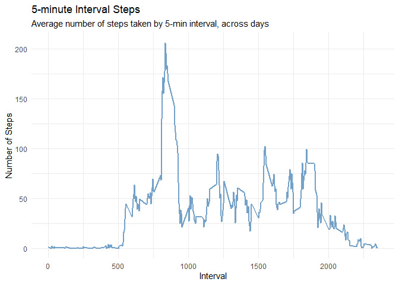
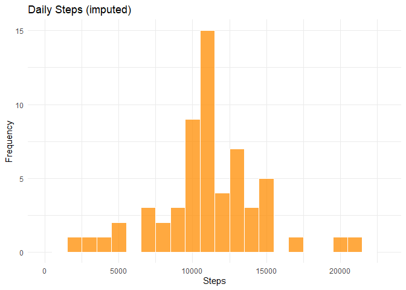
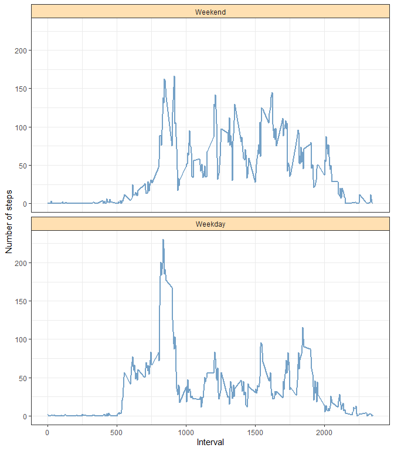

``` r
knitr::opts_chunk$set(echo = TRUE, fig.path = "figures/")
library(ggplot2)
```

```
## Warning: il pacchetto 'ggplot2' è stato creato con R versione 4.5.3
```

## Loading and preprocessing the data

The dataset comes with the forked repository as `activity.zip`, so we only unzip
it if `activity.csv` is not already present. Then we read it and store it in the `activity` variable.


``` r
if (!file.exists("activity.csv")) {
    unzip("activity.zip")
}

activity <- read.csv("activity.csv")
activity$date <- as.Date(activity$date, format = "%Y-%m-%d")

str(activity)
```

```
## 'data.frame':	17568 obs. of  3 variables:
##  $ steps   : int  NA NA NA NA NA NA NA NA NA NA ...
##  $ date    : Date, format: "2012-10-01" "2012-10-01" ...
##  $ interval: int  0 5 10 15 20 25 30 35 40 45 ...
```

## What is mean total number of steps taken per day?

NA values are ignored at the moment. The script below computes the step counts for each day and stores it in `daily_steps`. Then, the counts are plotted in a histogram.

Note that `aggregate()` with a formula drops the NA rows before summing, so the
days whose observations are entirely missing are left out of `daily_steps`
altogether rather than being counted as zero.


``` r
daily_steps <- aggregate(steps ~ date, data = activity, FUN = sum)

ggplot(daily_steps, aes(x = steps)) +
  geom_histogram(binwidth = 1000, fill = "steelblue", colour = "white", alpha = 0.75) +
  scale_x_continuous(limits = c(0, 23000)) +
  theme_minimal() +
  labs(title = "Daily Steps", x = "Steps", y = "Frequency")
```

```
## Warning: Removed 2 rows containing missing values or values outside the scale range
## (`geom_bar()`).
```

<!-- -->

Now, let's compute and see the mean and the median!


``` r
mean_steps <- mean(daily_steps$steps)
median_steps <- median(daily_steps$steps)

mean_steps
```

```
## [1] 10766.19
```

``` r
median_steps
```

```
## [1] 10765
```

The mean total number of steps taken per day is
10,766.19 and the median is
10,765.

## What is the average daily activity pattern?

NA values are still ignored. The script below computes the average daily activity pattern and stores it in `interval_avg`. Then, a line plot is created showing the daily pattern.


``` r
interval_avg <- aggregate(steps ~ interval, data = activity, FUN = mean)

ggplot(interval_avg, aes(x = interval, y = steps)) + 
  geom_line(color = "steelblue", alpha = 0.75, linewidth = 0.75) +
  theme_minimal() + 
  labs(title = "5-minute Interval Steps", subtitle = "Average number of steps taken by 5-min interval, across days",
       x = "Interval", y = "Number of Steps")
```

<!-- -->

Let's find and see the maximum value!


``` r
max_interval <- interval_avg$interval[which.max(interval_avg$steps)]
max_interval
```

```
## [1] 835
```

Interval **835** contains, on average across all the days in the
dataset, the maximum number of steps
(206.17 steps).


## Imputing missing values

It's time to take into account the missing (i.e., NA) values. First, we need to count how many NA values are in the dataset


``` r
total_na <- sum(is.na(activity$steps))
total_na
```

```
## [1] 2304
```

There are 2,304 rows with missing step counts.

**How can we solve that?** Our strategy will be the following: each missing value is replaced by the mean number of steps for
that same 5-minute interval, computed across all days.


``` r
activity_filled <- activity
na_idx <- is.na(activity_filled$steps)
activity_filled$steps[na_idx] <- interval_avg$steps[match(activity_filled$interval[na_idx],interval_avg$interval)]

sum(is.na(activity_filled$steps))
```

```
## [1] 0
```


``` r
daily_steps_filled <- aggregate(steps ~ date, data = activity_filled, FUN = sum)

ggplot(daily_steps_filled, aes(x = steps)) +
  geom_histogram(binwidth = 1000, fill = "darkorange", colour = "white", alpha = 0.75) +
  scale_x_continuous(limits = c(0, 23000)) +
  theme_minimal() +
  labs(title = "Daily Steps (imputed)", x = "Steps", y = "Frequency")
```

```
## Warning: Removed 2 rows containing missing values or values outside the scale range
## (`geom_bar()`).
```

<!-- -->


``` r
mean_filled <- mean(daily_steps_filled$steps)
median_filled <- median(daily_steps_filled$steps)
```

**What did it happen?** Both the mean and the median increase. In the original data every day
missing observations summed to zero because of
`na.rm = TRUE`, which piled eight artificial zeros at the left edge of the
histogram and dragged the mean down. Replacing the missing values with the
interval means gives each of those days the average daily total, so the mean
and median both increase.


## Are there differences in activity patterns between weekdays and weekends?

Let's see whether activity patterns change depending on the day type. First, we need to assign all observations a label depending on whether it is a weekday or a weekend.

`weekdays()` returns day names in the system locale, so we temporarily switch to
the C locale to be sure we are comparing against English names.


``` r
old_locale <- Sys.getlocale("LC_TIME")
Sys.setlocale("LC_TIME", "C")
```

```
## [1] "C"
```

``` r
what_day <- weekdays(activity_filled$date)

is_weekday <- factor(ifelse(what_day %in% c("Saturday", "Sunday"), "Weekend", "Weekday"),
                     levels = c("Weekend", "Weekday")) 

activity_filled$daytype <- is_weekday

Sys.setlocale("LC_TIME", old_locale)
```

```
## [1] "Italian_Italy.utf8"
```

``` r
table(activity_filled$daytype)
```

```
## 
## Weekend Weekday 
##    4608   12960
```


``` r
pattern_by_type <- aggregate(steps ~ interval + daytype, data = activity_filled, FUN = mean)

ggplot(pattern_by_type, aes(x = interval, y = steps)) +
  geom_line(colour = "steelblue", alpha = 0.75, linewidth = 0.75) +
  facet_wrap(~ daytype, ncol = 1) +
  labs(x = "Interval", y = "Number of steps") +
  theme_bw() +
  theme(strip.background = element_rect(fill = "#ffe0b2"))
```

<!-- -->

On weekdays activity spikes sharply during the morning commute and stays low
for the rest of the day, whereas on weekends the steps are spread more evenly
across the daytime hours and start later in the morning.
